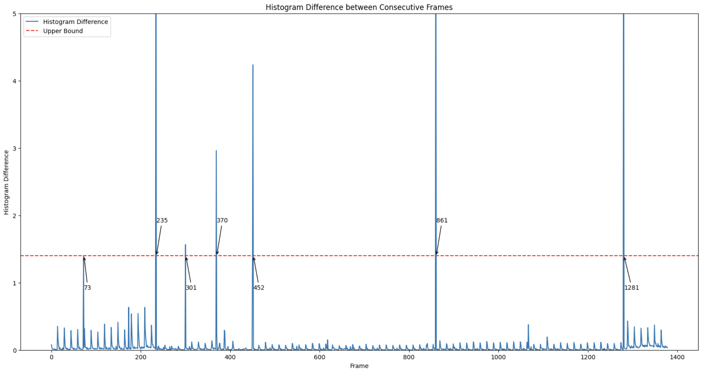
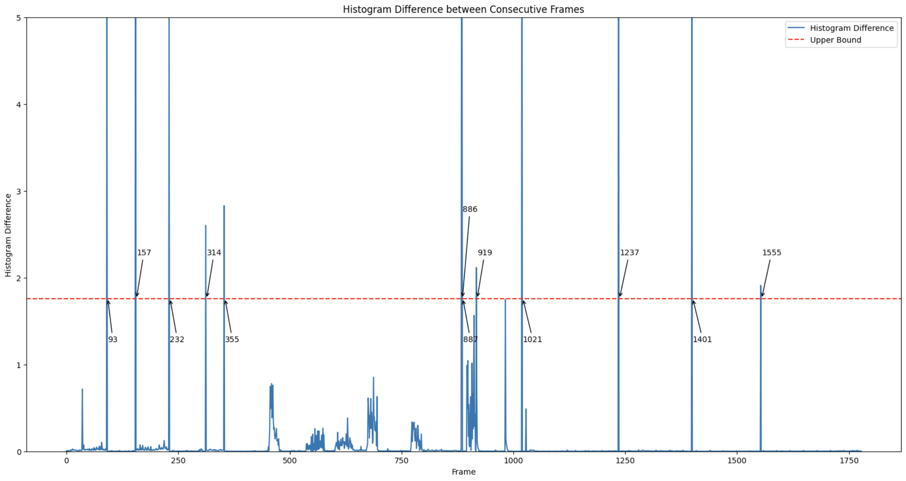
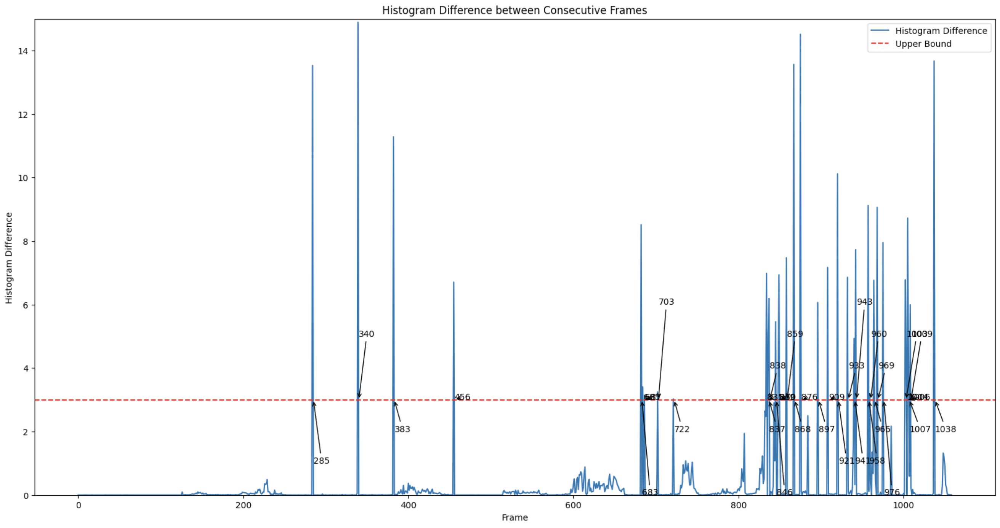

# Video Shot Change Detection

[]() []()

🚀 check out the [report](https://github.com/JenLungHsu/Music-Genre-Classification/blob/main/Music%20Genre%20Classification.pdf) for more detail.

## Overview
This project focuses on **shot change detection** and **fade detection** in video streams using **Color Histograms** as the primary visual feature. The implementation includes:
- **Shot Change Detection:** Frame-by-frame histogram comparison.
- **Fade In/Out Detection:** Multi-frame histogram analysis.

---

## Execution Environment
- **Language:** Python  
- **Libraries:** OpenCV, Numpy, Matplotlib  
- **Platform:** Jupyter Notebook (`Video Shot Change Detection.ipynb`)

---

## Dataset
- **Download Link:** [Google Drive - Video Data](https://drive.google.com/drive/folders/1Wt7oHhzVTwBn5i8YMocNVo-1KjGaxIYZ?usp=sharing)
 
---


## Visual Features Used

When using **Color Histograms** as visual features, we gain several advantages and properties in image analysis and recognition. Color histograms are an effective tool to understand the color distribution in images, providing crucial information about the image content.

1. **Color Frequency Analysis**:
   - Color histograms provide insights into the frequency of different colors in the image. This allows for the analysis of dominant colors and their distribution, which helps in distinguishing between different images.

2. **Computational Efficiency**:
   - The computation of color histograms is relatively simple and efficient, enabling quick extraction of color features without excessive computational resources. This is particularly important for processing large datasets or real-time applications.

3. **Invariance to Image Size Changes**:
   - Color histograms are not sensitive to changes in image size, meaning that even if the resolution varies, the color distribution remains accurately represented.

4. **Similarity and Difference Quantification**:
   - By comparing color histograms of different images, we can quantify their similarity or difference. This is essential for image retrieval, similarity search, and content matching.

---

## Detection Algorithms

### **Shot Change Detection**
The algorithm compares the **color histograms** of the current frame and the next frame. If the difference exceeds a certain threshold, it is classified as a **shot change**. However, this method may occasionally detect two shot changes within three consecutive frames, which is unrealistic. To mitigate this, such cases are explicitly filtered out.

### **Fade In/Out Detection**
This method also compares the **color histograms** of consecutive frames. If the difference surpasses a specified **lower threshold**, it is temporarily stored. If this continues for more than three frames and the cumulative difference exceeds an **upper threshold**, it is classified as a **Fade In/Out**.

To further enhance detection accuracy, the data is divided into two segments, and different thresholds are applied to each segment.

---

## Detection Performance

The detected results for **Shot Change** and **Fade In/Out** are marked as `1`, while missed detections or false positives are marked as `0`. The performance is evaluated using **Precision** and **Recall**, which are calculated as follows:

$$ Precision = \frac{TP}{TP + FP} $$

$$ Recall = \frac{TP}{TP + FN} $$


Where:
- **TP (True Positive)**: Correctly detected changes
- **FP (False Positive)**: Incorrectly detected changes
- **FN (False Negative)**: Missed detections

---

## Results

### Video 1: **news**
- **Precision:** 100%
- **Recall:** 100%




### Video 2: **climate**
- **Precision:** 93.33%
- **Recall:** 93.33%




### Video 3: **ngc**
- **Precision:** 85.71%
- **Recall:** 83.33%




---

## Strengths and Limitations
### ✅ **Strengths**
- High precision and recall for clean-cut shot changes.
- Robust to minor lighting changes and noise.

### ❌ **Limitations**
- Long fades may sometimes be partially detected.
- Complex transitions (e.g., overlapping fades and cuts) may require further optimization.

---

## Usage
To execute the notebook:
```bash
pip install -r requirements.txt
jupyter notebook 'Video Shot Change Detection.ipynb'
```

---

## Contact
- **Author:** Jen Lung Hsu
- **Email:** RE6121011@gs.ncku.edu.tw
- **Institute:** National Cheng Kung University, Institute of Data Science
